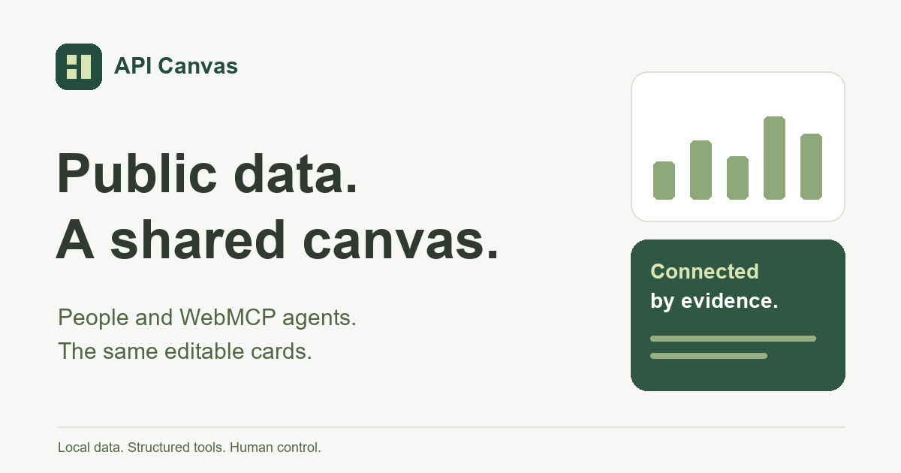

# API Canvas

Turn public data into connected cards. People and WebMCP agents use the same Vue interface, Pinia actions and local dashboard model.

[Live canvas](https://api-canvas-bclonan.netlify.app/) · [WebMCP tools](https://api-canvas-bclonan.netlify.app/webmcp) · [Hackathon overview](https://api-canvas-bclonan.netlify.app/hackathon)



The native catalog currently contains 37 tools. `/webmcp` derives its cards, schemas and classifications from the canonical `nativeContracts` export. Older compatibility aliases remain in the local runner and are not counted as native tools.

## Run locally

Use Node.js 22.12 or newer and a current browser.

```sh
npm ci
npx playwright install chromium
npm run dev
```

Open http://127.0.0.1:5173. Vite uses an explicit IPv4 address and a strict port. This is a local-first application with no account system or hosted LLM.

```sh
npm run lint
npm run typecheck
npm test
npm run build
npm run test:e2e
# Or run all gates in order:
npm run verify
npm run preview
```

The Playwright suite starts its own Vite server on port 5194. Close another server on that port before running it. `npm run test:apis` probes the catalog on the live deployment. Real provider availability varies; review the recorded date and failures in [API audit](docs/API_AUDIT.md).

## Environment and browser access

The main workspace needs no API key. Public endpoints must allow browser access. JSON, CSV, XML, feeds, permitted HTML tables and embedded JSON use the shared adapters; the app does not provide an unrestricted proxy or execute supplied scripts.

Optional server setting `UNSPLASH_ACCESS_KEY` enables the bounded Unsplash Netlify function. Set it in Netlify's environment and redeploy. Never put credentials in VITE variables, source URLs, public headers or shared state. [Image and open data APIs](docs/IMAGE_AND_OPEN_DATA_APIS.md) describes attribution and provider requirements. Census live access requires a key that this adapter does not currently accept, so its supported fixture remains explicitly labeled sample.

Optional `VITE_DEMO_VIDEO_URL` is a public HTTPS YouTube URL for the hackathon embed. It is not a credential. URLs and submission status are centralized in `src/site/project.json`; the video remains `[YOUTUBE_URL]` until configured.

Native tools require an experimental WebMCP-capable browser and a compatible connected agent. API Canvas detects `document.modelContext.registerTool` and reports availability. It never installs a substitute API. The local tool runner works without native support but is not evidence of a native connection. Follow the current [Chrome imperative API documentation](https://developer.chrome.com/docs/ai/webmcp/imperative-api) for browser availability.

## Use the canvas

Choose a starter dashboard or source in Discover, or add a public source through the generic source editor. Cards expose Interface, Data, Request and Code views. Original responses stay available beside normalized data. Sources are separate from presentation; changing a chart to a table can reuse the same response.

Local dashboard management supports create, rename, switch, duplicate, clear and delete. Each dashboard preserves its layout, sources, bindings and presentation settings. Clearing and deleting require confirmation. Undo clear is available while that dashboard remains empty. The previous single-workspace storage migrates without erasing its original entry.

Select fields in Connect data to build a derived card. Declarative mappings support selection, filtering, sorting, grouping, arithmetic and joins. No supplied code runs. Drag cards, use their move controls, or ask WebMCP to reorder and resize them. Cards fill available row space and stack on mobile.

Add content creates notes, cited answers, datasets, search results, media embeds and local file cards. Question cards capture all cards or a chosen subset. A connected agent reads the structured question context and submits one to six ordinary answer blocks; these remain editable, connected and queryable. Local files require a user selection or reconnection. Supported previews reuse the existing renderers; unavailable references retain metadata and a recovery action.

Use sample mode for labeled illustrative fixtures. Live failures stay errors until a retry succeeds or you explicitly select sample data. A reload replays safe GET requests and samples; other methods wait for a visible request action. Source requests can be cancelled, and stale responses cannot overwrite another dashboard.

Share / present creates a redacted snapshot at `/#share=...`, with no editing chrome or source requests. Review it before distributing the link. Credentials, file handles, local paths and attachment bytes are excluded. Answer text or derived values copied from files can still be included, so inspect the preview. Configuration export preserves one dashboard; import validates before replacement and leaves other dashboards intact.

## Architecture

```text
Human UI or WebMCP arguments
  -> input validation and permission checks
  -> existing workspace actions and API adapters
  -> raw response + normalized data + provenance
  -> declarative transforms and bindings
  -> reusable component inside WidgetShell
  -> visible Vue update and structured tool result
```

- `src/App.vue` owns restore, refresh scheduling and WebMCP registration. Minimal History API navigation adds `/webmcp` and `/hackathon` while keeping this shell mounted. Clean hash-based sharing remains separate.
- `src/stores/workspace.ts` owns cards, revisions, dashboards and shared actions. Small recipes use localStorage. `src/runtime/persistence.ts` stores response caches, request history and local files in IndexedDB.
- `src/api/registry.ts`, `src/api/providers/` and `src/sources/` define providers, generated inputs, extraction and generic public-data adapters.
- `src/runtime/` handles normalization, inference, field paths, errors and bounded transforms. Raw values remain separate from displayed values.
- `src/blocks/definitions.ts` is the component registry. `BlockRenderer.vue` dispatches reusable tables, charts, maps, sports cards, content, media and other views. ECharts loads separately. Maps are schematic coordinate views with map-service links.
- `src/webmcp/contracts.ts` and `workspaceTools.ts` define tools and schemas. `handlers.ts` validates inputs with AJV; `register.ts` chooses the native set and owns registration cancellation. Workspace tools check output envelopes; older tools retain their result shapes.
- `src/site/toolDocs.ts` derives documentation from that same native set. It supplies editorial examples and workflows, never another registration system. Tests validate every argument example against its real JSON Schema.
- `vite.config.ts` emits route-specific HTML metadata. `netlify.toml` retains the existing SPA fallback, security headers and build configuration.

## Add a tool or source

Add a strict contract in `src/webmcp/workspaceTools.ts` and dispatch it through `runWorkspaceTool` to the existing domain/store action. Workspace contracts are included in native registration automatically. For older general contracts in `contracts.ts`, explicitly select them in `register.ts` if they should be native.

Add a valid argument example and optional prompt override in `src/site/toolDocs.ts`. New workflows must refer to registered tool names and explain their data dependencies, approval boundary and partial failures. Use current source IDs and revision checks for mutations. Keep untrusted content inert, propagate cancellation, and return actionable outcomes.

Add provider operations through `defineApi` in `src/api/providers/` and the existing registry. Supply inputs, request construction, extraction and a clearly labeled fixture. Reuse semantic hints and components before creating a new renderer.

Tests should cover meaningful validation and state changes, errors, permissions and UI editability. Run `npm run verify` before a contribution. Update the relevant guide, source examples and release evidence. Do not commit credentials, private responses or local attachments.

## Deployment and submission status

The existing linked Netlify site is `api-canvas-bclonan`. Build and verify before deploying the same site:

```sh
npx netlify status
npm run build
npx netlify deploy --dir dist --functions netlify/functions --no-build --prod
```

For a Windows certificate-chain issue, the existing environment supports Node's system certificate store using a temporary `NODE_OPTIONS=--use-system-ca`. Do not disable TLS validation.

The live root URL responded on September 3, 2026. [Verification notes](docs/VERIFICATION.md) distinguish new local checks from deployed evidence. `/hackathon` includes the project explanation, architecture, extension guide and submission checklist. [Demo script](docs/demo-video-script.md) contains the exact 2:50 narration also shown on the page.

Detected repository: https://github.com/bclonan/api-view. An unauthenticated GitHub API check returned 404 on September 3, 2026. Public access is unverified, and this release must be pushed before claiming complete public source. No push or repository visibility change is performed by the app. The video is still `[YOUTUBE_URL]`; record, upload and verify public access, audio and duration before submission.

MIT licensing now covers the project code in this checkout. No prior root license existed. Bundled fonts retain their OFL notices under `public/fonts/`. Public data and third-party media retain their source-specific terms and attribution requirements.

## Guides and limits

- [Public sources and connected blocks](docs/PUBLIC_SOURCES.md)
- [Semantic normalization and component selection](docs/SEMANTIC_EXPANSION.md)
- [Agent guide](docs/AGENT_GUIDE.md)
- [Sports, places and source outcomes](docs/SCENARIO_BLOCKS.md)
- [Content, embeds and questions](docs/CONTENT_WORKFLOWS.md)
- [Local files and answer bundles](docs/LOCAL_FILES_AND_ANSWERS.md)
- [Dashboard layout](docs/DASHBOARD_LAYOUT.md)
- [Images and open collections](docs/IMAGE_AND_OPEN_DATA_APIS.md)

The workspace allows 40 cards, up to 30 saved dashboards and bounded request history. Transforms accept up to 20 steps and inspect at most 5,000 rows. Local file cards hold up to eight references, with bounded previews. These limits keep a browser workspace manageable. CORS, network failures, provider keys and rate limits can prevent live access. Missing data is reported rather than filled in silently.
